<h1 align="center">ML Matrics</h1>

<h4 align="center">

A toolkit of metrics and visualizations for model performance in data-driven materials discovery.

[](https://github.com/janosh/ml-matrics/actions)
[](https://results.pre-commit.ci/latest/github/janosh/ml-matrics/master)
[](/license)
[](https://github.com/janosh/ml-matrics/graphs/contributors)
[](https://python.org/downloads)

</h4>

## Installation

```sh
pip install -U git+https://github.com/janosh/ml-matrics
```

For a locally editable install, use

```sh
git clone https://github.com/janosh/ml-matrics && pip install -e ml-matrics
```

To specify a dependence on this package in `requirements.txt`, use

```txt
pandas==1.1.2
numpy==1.20.1
git+git://github.com/janosh/ml-matrics
```

To specify a specific branch or commit, append its name or hash, e.g.

```txt
git+git://github.com/janosh/ml-matrics@master # default
git+git://github.com/janosh/ml-matrics@41b95ec
```

## Parity Plots

See [`ml_matrics/parity.py`](ml_matrics/parity.py).

|      [`density_scatter(xs, ys, ...)`](ml_matrics/parity.py)       |  [`density_scatter_with_hist(xs, ys, ...)`](ml_matrics/parity.py)  |
| :---------------------------------------------------------------: | :----------------------------------------------------------------: |
|          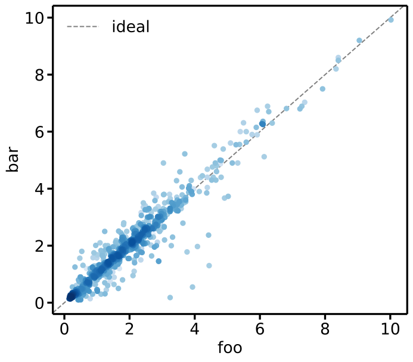           | 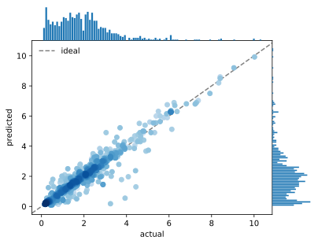 |
|       [`density_hexbin(xs, ys, ...)`](ml_matrics/parity.py)       |  [`density_hexbin_with_hist(xs, ys, ...)`](ml_matrics/parity.py)   |
|                       |  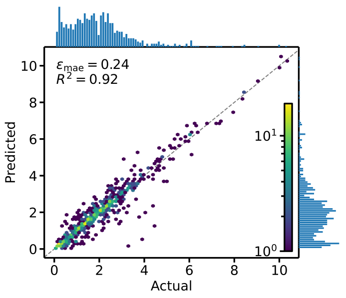  |
| [`scatter_with_err_bar(xs, ys, yerr, ...)`](ml_matrics/parity.py) | [`residual_vs_actual(y_true, y_pred, ...)`](ml_matrics/parity.py)  |
|     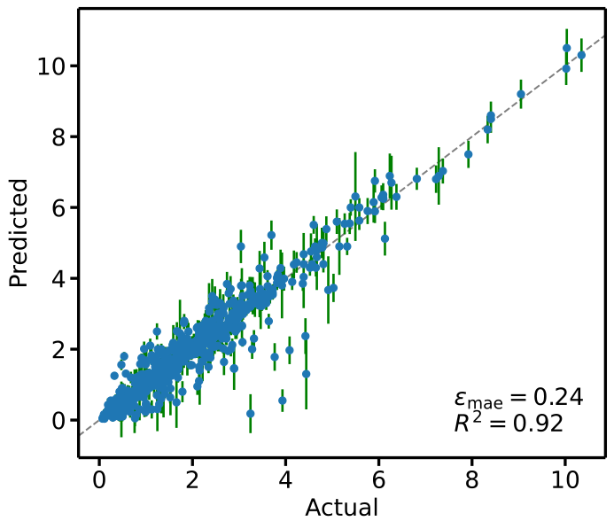      |        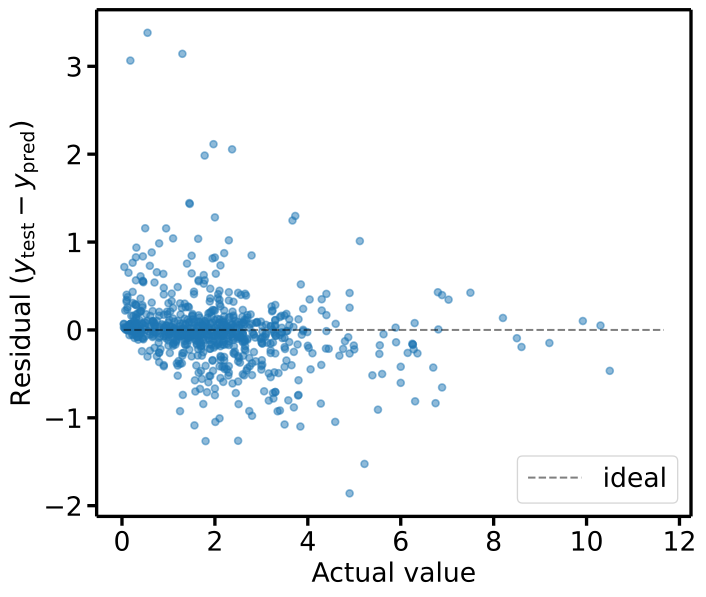        |

## Elements

See [`ml_matrics/elements.py`](ml_matrics/elements.py).

| [`ptable_elemental_prevalence(compositions)`](ml_matrics/elements.py)  |          [`ptable_elemental_prevalence(compositions, log=True)`](ml_matrics/elements.py)          |
| :--------------------------------------------------------------------: | :-----------------------------------------------------------------------------------------------: |
| 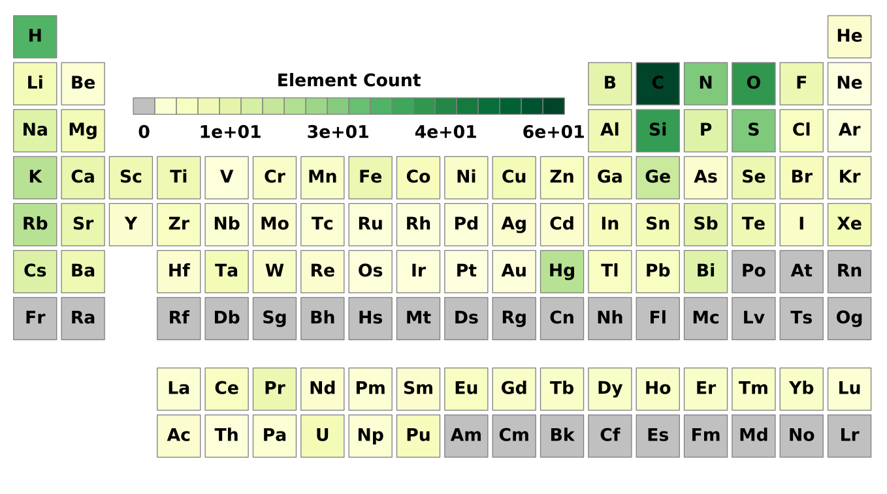 |          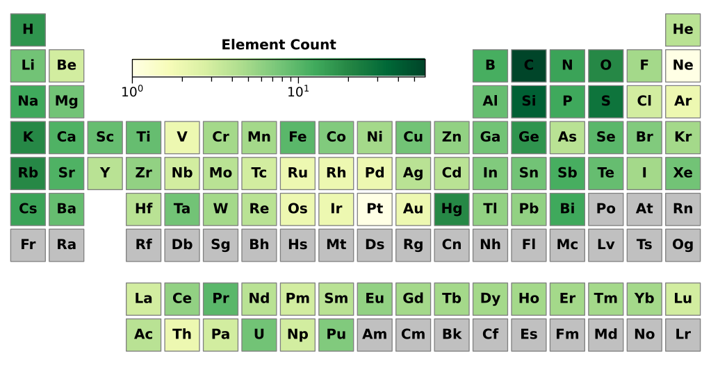           |
|  [`hist_elemental_prevalence(compositions)`](ml_matrics/elements.py)   | [`hist_elemental_prevalence(compositions, log=True, bar_values='count')`](ml_matrics/elements.py) |
|   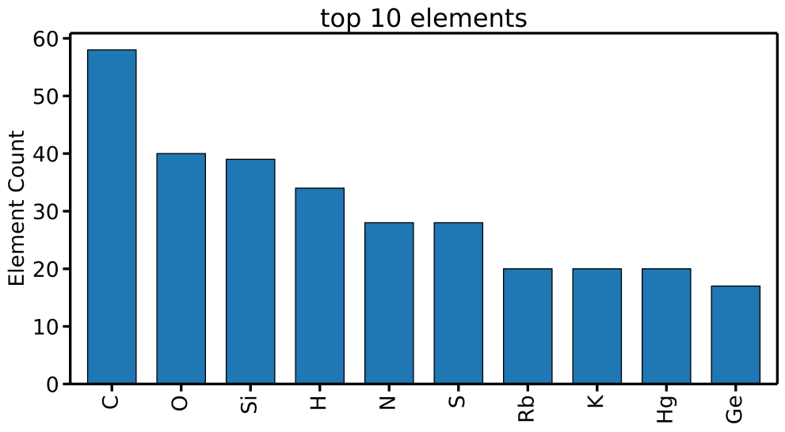   |      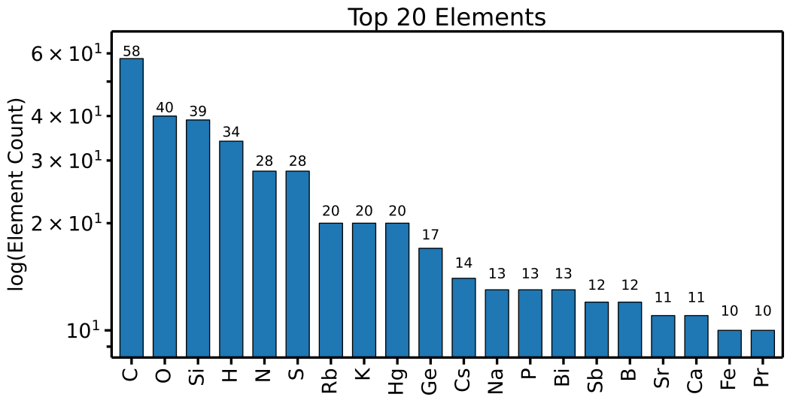       |
|  [`ptable_elemental_ratio(comps_a, comps_b)`](ml_matrics/elements.py)  |          [`ptable_elemental_ratio(comps_b, comps_a, log=True)`](ml_matrics/elements.py)           |
|      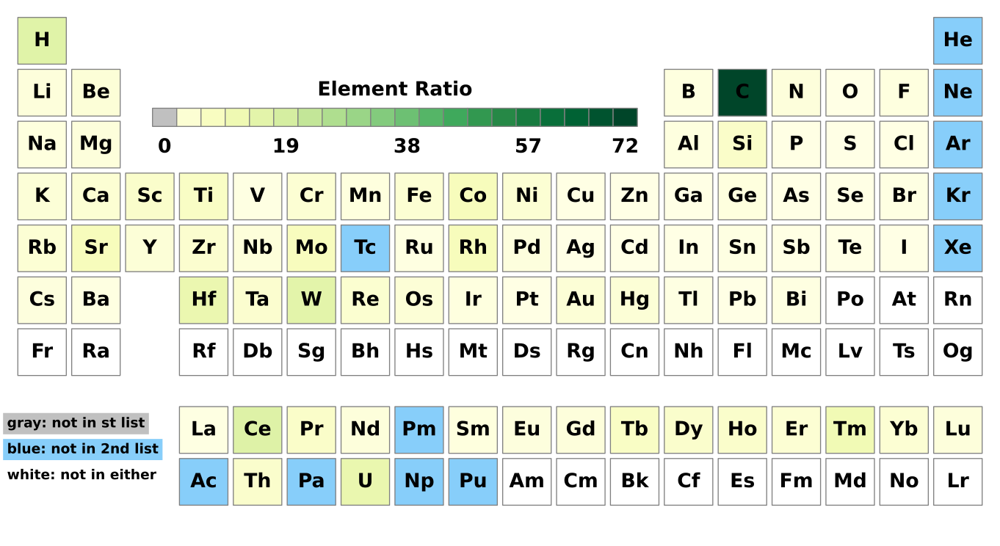      |               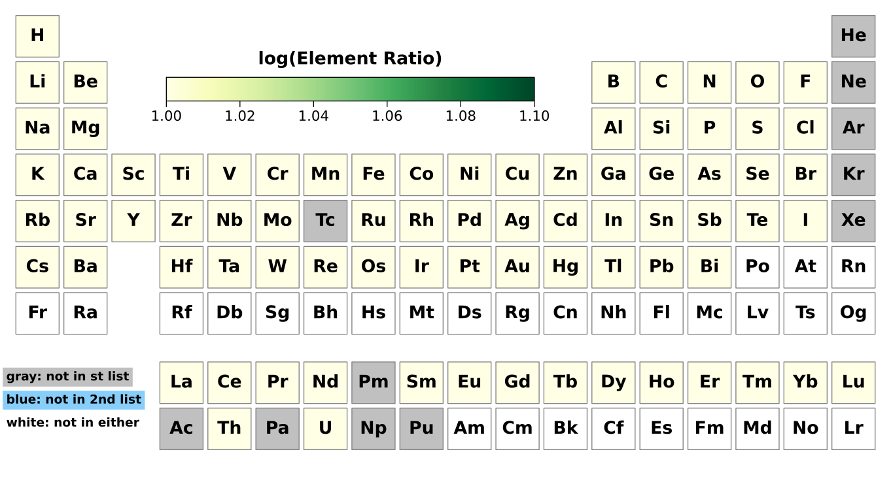                |

## Uncertainty Calibration

See [`ml_matrics/quantile.py`](ml_matrics/quantile.py).

| [`qq_gaussian(y_true, y_pred, y_std)`](ml_matrics/quantile.py) | [`qq_gaussian(y_true, y_pred, y_std: dict)`](ml_matrics/quantile.py) |
| :------------------------------------------------------------: | :------------------------------------------------------------------: |
|                |  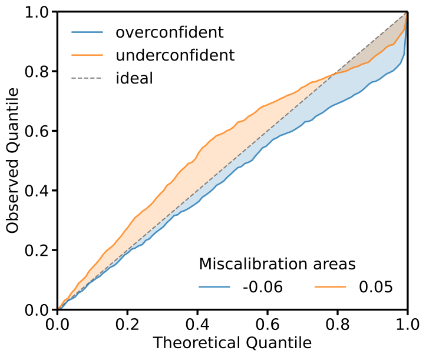  |

## Ranking

See [`ml_matrics/ranking.py`](ml_matrics/ranking.py).

| [`err_decay(y_true, y_pred, y_std)`](ml_matrics/ranking.py) | [`err_decay(y_true, y_pred, y_std: dict)`](ml_matrics/ranking.py) |
| :---------------------------------------------------------: | :---------------------------------------------------------------: |
|             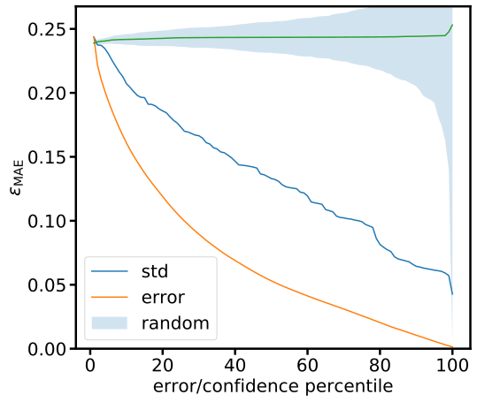              |       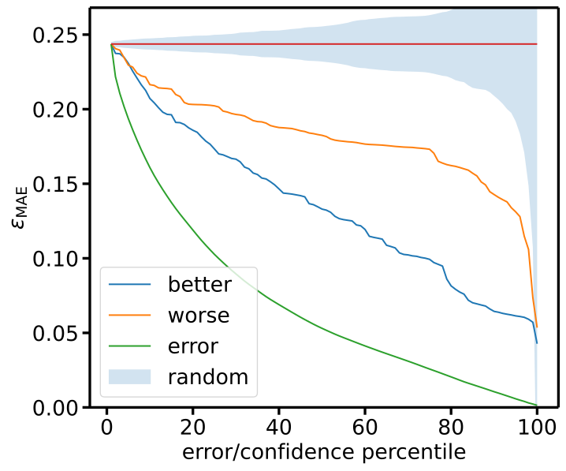        |

## Cumulative Error and Residual

See [`ml_matrics/cumulative.py`](ml_matrics/cumulative.py).

| [`cum_err(preds, targets)`](ml_matrics/cumulative.py) | [`cum_res(preds, targets)`](ml_matrics/cumulative.py)  |
| :---------------------------------------------------: | :----------------------------------------------------: |
|       | 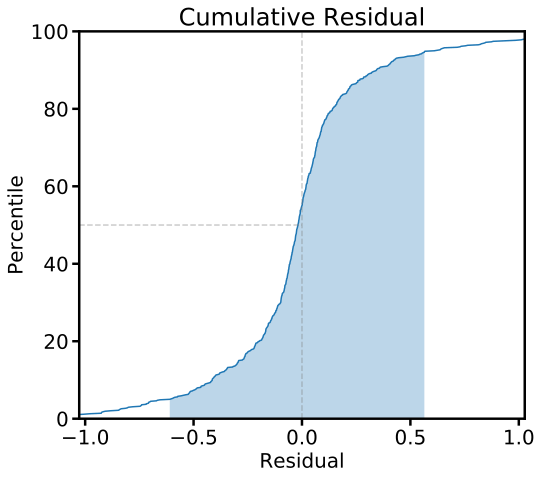 |

## Classification Metrics

See [`ml_matrics/relevance.py`](ml_matrics/relevance.py).

| [`roc_curve(targets, proba_pos)`](ml_matrics/relevance.py) | [`precision_recall_curve(targets, proba_pos)`](ml_matrics/relevance.py) |
| :--------------------------------------------------------: | :---------------------------------------------------------------------: |
|             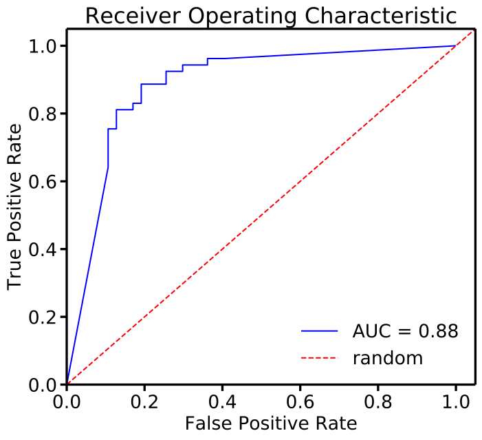             |      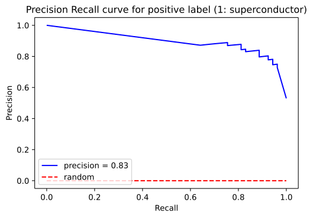       |

## Correlation

See [`ml_matrics/correlation.py`](ml_matrics/correlation.py).

| [`marchenko_pastur(corr_mat, gamma=ncols/nrows)`](ml_matrics/correlation.py) | [`marchenko_pastur(corr_mat_significant_eval, gamma=ncols/nrows)`](ml_matrics/correlation.py) |
| :--------------------------------------------------------------------------: | :-------------------------------------------------------------------------------------------: |
|               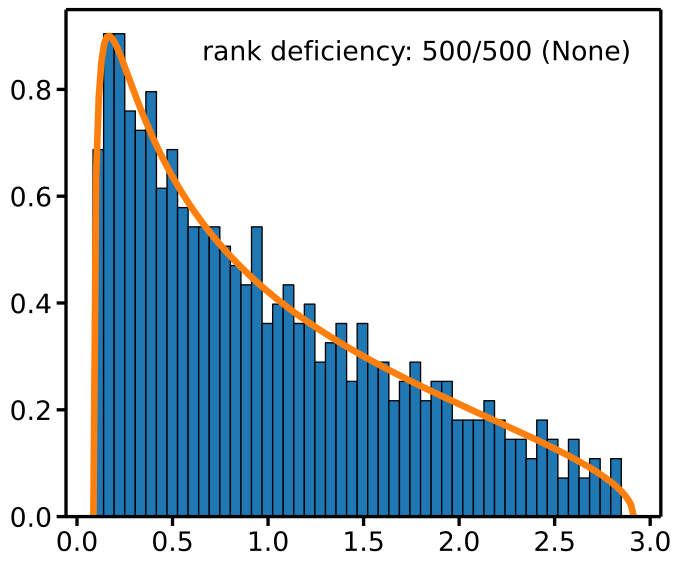               |      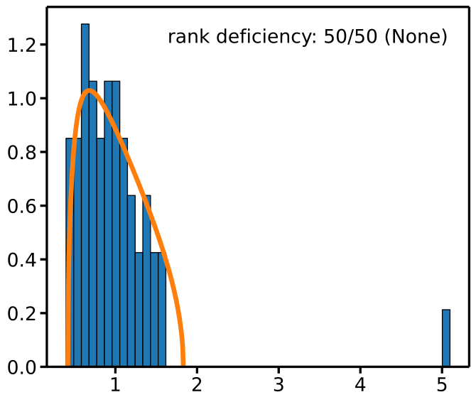       |

## Histograms

See [`ml_matrics/histograms.py`](ml_matrics/histograms.py).

|  [`residual_hist(y_true, y_pred)`](ml_matrics/histograms.py)  | [`true_pred_hist(y_true, y_pred, y_std)`](ml_matrics/histograms.py) |
| :-----------------------------------------------------------: | :-----------------------------------------------------------------: |
|          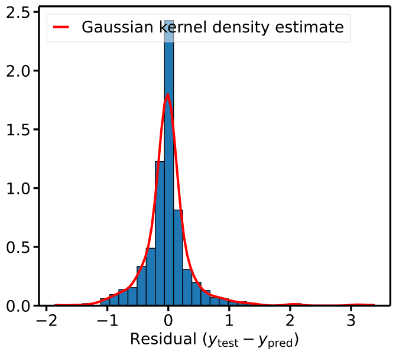           |            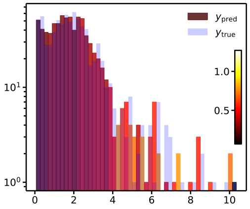             |
| [`spacegroup_hist(y_true, y_pred)`](ml_matrics/histograms.py) |                                                                     |
|        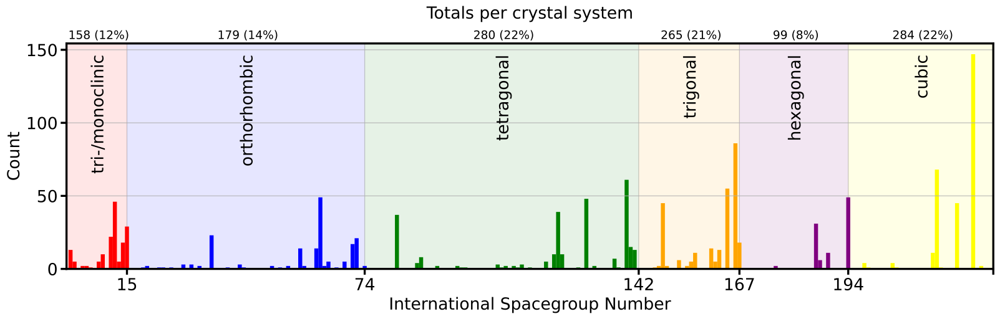         |                                                                     |

## Adding Assets

When adding new SVG assets, please compress them before committing. This can either be done online without setup at <https://vecta.io/nano> or on the command line with [`svgo`](https://github.com/svg/svgo). Install it with `npm -g svgo` (or `yarn global add svgo`). Then compress all assets in one go with `svgo assets`. (`svgo` is safe for multiple compressions).

## Testing

This project uses [`pytest`](https://docs.pytest.org/en/stable/usage.html). To run the entire test suite:

```sh
python -m pytest
```

To run individual or groups of test files, pass `pytest` a path or glob pattern, respectively:

```sh
python -m pytest tests/test_cumulative.py
python -m pytest **/test_*_metrics.py
```

To run a single test, pass its name to the `-k` flag:

```sh
python -m pytest -k test_precision_recall_curve
```

Consult the [`pytest`](https://docs.pytest.org/en/stable/usage.html) docs for more details.

## Glossary

1. **Residual** `y_res = y_true - y_pred`: The difference between ground truth target and model prediction.
2. **Error** `y_err = abs(y_true - y_pred)`: Absolute error between target and model prediction.
3. **Uncertainty** `y_std`: The model's estimate for its error, i.e. how much the model thinks its prediction can be trusted. (`std` for standard deviation.)
