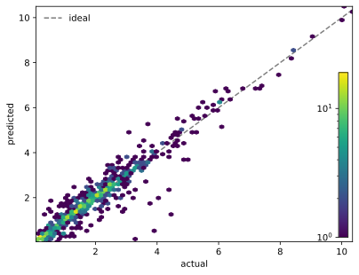
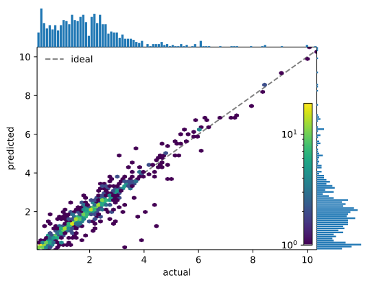
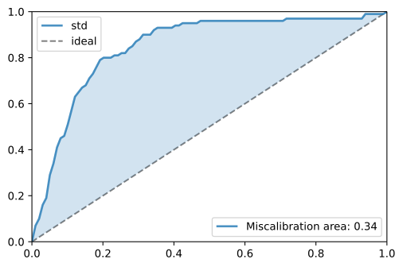
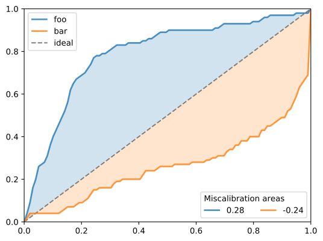
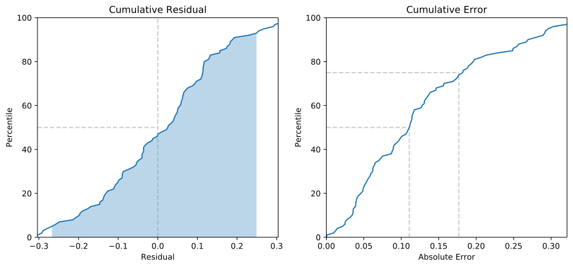

<h1 align="center">ML Matrics</h1>

<h4 align="center">

A toolkit of metrics and visualizations for model performance in data-driven materials discovery.

[](https://github.com/janosh/mlmatrics/actions)
[](https://results.pre-commit.ci/latest/github/janosh/mlmatrics/master)
[](/license)
[](https://github.com/janosh/mlmatrics/graphs/contributors)
[](https://github.com/janosh/mlmatrics/commits)

</h4>

## Installation

```sh
pip install git+https://github.com/janosh/mlmatrics
```

For a locally editable install, use

```sh
git clone https://github.com/janosh/mlmatrics && pip install -e mlmatrics
```

## Density Scatter

|     [`density_scatter.svg`](assets/density_scatter.svg)     |     [`density_scatter_with_hist.svg`](assets/density_scatter_with_hist.svg)     |
| :---------------------------------------------------------: | :-----------------------------------------------------------------------------: |
|               |               |
| [`density_scatter_hex.svg`](assets/density_scatter_hex.svg) | [`density_scatter_hex_with_hist.svg`](assets/density_scatter_hex_with_hist.svg) |
|       |       |

## Elements

| [`ptable_elemental_prevalence.svg`](assets/ptable_elemental_prevalence.svg) | [`hist_elemental_prevalence.svg`](assets/hist_elemental_prevalence.svg) |
| :-------------------------------------------------------------------------: | :---------------------------------------------------------------------: |
|       |       |

## Uncertainty Calibration

| [`std_calibration_single.svg`](assets/std_calibration_single.svg) | [`std_calibration_multiple.svg`](assets/std_calibration_multiple.svg) |
| :---------------------------------------------------------------: | :-------------------------------------------------------------------: |
|       |       |

## Cumulative Error and Residual

|                     [`cumulative_error.svg`](assets/cumulative_error.svg)                     | [`cumulative_residual.svg`](assets/cumulative_residual.svg) |
| :-------------------------------------------------------------------------------------------: | :---------------------------------------------------------: |
|                                               |       |
| [`cumulative_error_cumulative_residual.svg`](assets/cumulative_error_cumulative_residual.svg) |                                                             |
|       |                                                             |

## Classification Metrics

|              [`roc_curve.svg`](assets/roc_curve.svg)               | [`precision_recall_curve.svg`](assets/precision_recall_curve.svg) |
| :----------------------------------------------------------------: | :---------------------------------------------------------------: |
|                                  |       |
| ```from mlmatrics import roc_curve roc_curve(y_binary, y_proba)``` |            `precision_recall_curve(y_binary, y_proba)`            |

## Adding Assets

When adding new SVG assets, please compress them before committing. This can either be done online without setup at <https://vecta.io/nano> or on the command line with [`svgo`](https://github.com/svg/svgo). Install it with `npm -g svgo` (or `yarn global add svgo`). Then compress all assets in one go with `svgo assets`. (`svgo` is safe for multiple compressions).

## Testing

This project uses [`pytest`](https://docs.pytest.org/en/stable/usage.html). To run the entire test suite:

```sh
python -m pytest
```

To run individual or groups of test files, pass `pytest` a path or glob pattern, respectively:

```sh
python -m pytest tests/test_cumulative.py
python -m pytest **/test_*_metrics.py
```

You can also run single tests by passing its name to the `-k` flag:

```sh
python -m pytest -k test_precision_recall_curve
```

Consult the [`pytest`](https://docs.pytest.org/en/stable/usage.html) docs for more details.
